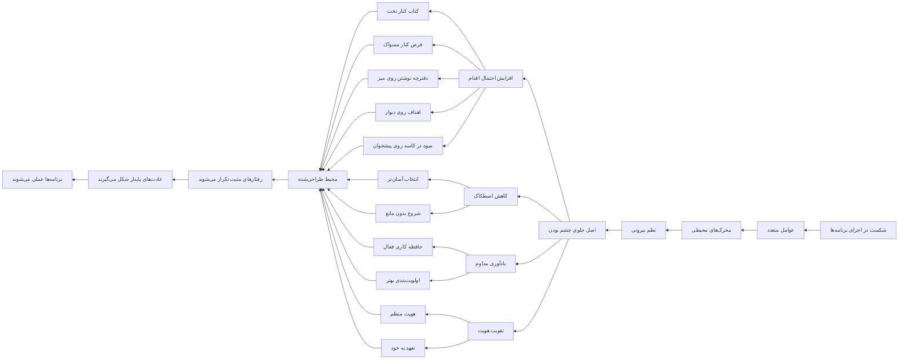

---
{"dg-publish":true,"dg-permalink":"/spd/visible-reminder","permalink":"/spd/visible-reminder/","dgPassFrontmatter":true,"dg-note-properties":{}}
---

## ترفندی که شکست برنامه‌ها را به موفقیت تبدیل می‌کند

همه ما با آن لحظه آشناییم. لحظه‌ای که با انگیزه‌ای سرشار پشت میز می‌نشینیم، دفتر برنامه‌ریزی را باز می‌کنیم و برای هفته یا ماه آینده‌مان نقشه می‌کشیم. ورزش، مطالعه، نوشتن، تغذیه سالم، کاهش استفاده از شبکه‌های اجتماعی؛ فهرستی که با خوش‌بینی نوشته می‌شود و با همان سرعت، در میان هیاهوی زندگی روزمره گم می‌شود. چند روز بعد، وقتی دوباره به آن فهرست نگاه می‌کنیم، حسی آشنا سراغمان می‌آید: ترکیبی از شرم، ناامیدی و این سؤال تکراری که «چرا باز نشد؟»

پاسخ این سؤال هرگز ساده نیست. شکست در اجرای برنامه‌ها معمولاً حاصل یک عامل نیست، بلکه نتیجه هم‌زمان چندین متغیر است که برخی از آن‌ها بیرون از کنترل ما به نظر می‌رسند. اما واقعیت این است که بخش قابل توجهی از موفقیت یا شکست ما در اجرای عادت‌ها، به چیزی گره خورده که شاید هرگز جدی نگرفته‌ایم: محیط پیرامون‌مان. به بیان دقیق‌تر، آنچه که در برابر چشمان ما قرار دارد و هر روز، بی‌آنکه متوجه باشیم، انتخاب‌های ما را شکل می‌دهد.

## محرک‌های محیطی؛ فرماندهان خاموش رفتار ما

محرک‌های محیطی، نشانه‌هایی هستند که از طریق حواس ما وارد ذهن می‌شوند و رفتاری خاص را فعال می‌کنند. این نشانه‌ها می‌توانند بصری باشند، مثل دیدن یک بسته چیپس روی کانتر آشپزخانه؛ یا شنیداری باشند، مثل صدای اعلان پیام در گوشی؛ حتی بویایی، مثل عطر قهوه که میل به نوشیدنش را بیدار می‌کند. مغز ما به شکلی شگفت‌انگیز به این نشانه‌ها واکنش نشان می‌دهد، آن هم اغلب بدون آنکه ما آگاهانه متوجه شویم.

تحقیقات در حوزه روان‌شناسی عادت نشان داده که بخش عمده‌ای از رفتارهای روزمره ما، نه از روی تصمیم آگاهانه، بلکه در پاسخ به همین نشانه‌های محیطی انجام می‌شود. وندی وود، استاد روانشناسی دانشگاه کالیفرنیای جنوبی، در کتاب «عادت‌های خوب، عادت‌های بد» اشاره می‌کند که حدود ۴۳ درصد از رفتارهای روزانه ما در حالی انجام می‌شود که ذهن‌مان در جای دیگری است. این یعنی تقریباً نیمی از کارهایی که در طول روز انجام می‌دهیم، بر اساس الگوهای از پیش شکل‌گرفته و در واکنش به محیط اطراف‌مان است، نه بر اساس اراده و تصمیم لحظه‌ای.

حالا فکر کنید این یعنی چه. یعنی اگر می‌خواهید تغییری در زندگی‌تان ایجاد کنید، تکیه صرف بر اراده و انگیزه، مثل این است که بخواهید با یک قایق پارویی برخلاف جریان یک رودخانه قدرتمند حرکت کنید. شاید چند متری پیش بروید، اما خیلی زود خسته می‌شوید و جریان آب شما را به همان جایی برمی‌گرداند که شروع کرده بودید. راه‌حل هوشمندانه‌تر این است که جهت جریان را تغییر دهید، یا حداقل از آن به نفع خودتان استفاده کنید. و این دقیقاً همان کاری است که دستکاری آگاهانه محرک‌های محیطی برای ما انجام می‌دهد.

## نظم بیرونی، پلی به نظم درونی

بسیاری از ما وقتی درباره «نظم» صحبت می‌کنیم، ذهن‌مان به سمت ویژگی‌های درونی می‌رود: اراده قوی، انضباط فردی، شخصیت منظم. اما واقعیت این است که نظم درونی، در بسیاری از موارد، محصول نظم بیرونی است. وقتی محیط اطراف ما منظم باشد، وقتی چیزهایی که برایمان مهم هستند در دسترس و قابل مشاهده باشند، و وقتی وسوسه‌ها و عوامل حواس‌پرتی از دیدرس ما دور باشند، رفتار منظم بسیار آسان‌تر شکل می‌گیرد.

جیمز کلیر، نویسنده کتاب «عادت‌های اتمی»، یکی از چهار قانون تغییر رفتار را «آشکار کردن» می‌داند. او می‌نویسد که اگر می‌خواهید عادتی در زندگی‌تان شکل بگیرد، باید نشانه‌های مربوط به آن را در محیط اطراف‌تان برجسته کنید. به عبارت دیگر، محیط را طوری طراحی کنید که رفتار مطلوب، ساده‌ترین و در دسترس‌ترین گزینه باشد. این دقیقاً همان منطق «جلوی چشم بودن» است.

نظم بیرونی فقط به معنای مرتب بودن میز کار یا اتاق نیست؛ بلکه به معنای طراحی آگاهانه محیطی است که در آن زندگی می‌کنیم، به شکلی که تصمیم‌گیری درست را آسان‌تر کند. وقتی کتابی که می‌خواهید بخوانید روی میز کنار تخت‌تان است، نه در قفسه کتابخانه پشت ده کتاب دیگر، احتمال خواندنش چندین برابر می‌شود. وقتی میوه‌ها را در یک کاسه زیبا روی کانتر آشپزخانه می‌گذارید، نه در کشوی یخچال، احتمال خوردنشان به‌طور چشمگیری افزایش می‌یابد. این یعنی محیط به جای اینکه مانع باشد، همراه می‌شود.

## قدرت دیده شدن؛ وقتی احتمال به نفع ما کار می‌کند

بگذارید صادق باشیم. جلوی چشم بودن، تضمینی نیست. هیچ روشی در حوزه عادت‌سازی وجود ندارد که صددرصد عمل کند. اما نکته مهم اینجاست که ما به دنبال تضمین نیستیم، به دنبال افزایش احتمال هستیم. و همین افزایش احتمال، وقتی در طول زمان تکرار شود، نتایج چشمگیری به بار می‌آورد. اگر جلوی چشم بودن فقط ده درصد احتمال انجام یک کار را افزایش دهد، این ده درصد در طول یک سال، ده‌ها بار تکرار می‌شود و تفاوت بزرگی ایجاد می‌کند.

مطالعه‌ای که در سال ۲۰۱۵ در دانشگاه کرنل انجام شد، نشان داد افرادی که میوه‌ها را در یک کاسه روی پیشخوان آشپزخانه نگه می‌دارند، به طور متوسط وزن کمتری نسبت به کسانی دارند که میوه‌ها را در یخچال یا کشو نگه می‌دارند. این تفاوت وزن به این دلیل است که دیدن مداوم میوه‌ها، انتخاب آن‌ها را به‌عنوان میان‌وعده آسان‌تر می‌کند. این مطالعه ساده اما قدرتمند، دقیقاً همان منطقی را نشان می‌دهد که درباره‌اش صحبت می‌کنیم: آنچه می‌بینیم، آنچه انتخاب می‌کنیم.

حالا بیایید این اصل را در حوزه‌های مختلف زندگی بررسی کنیم و ببینیم چگونه می‌تواند به کمک ما بیاید.

## مثال‌هایی از قدرت جلوی چشم بودن

**کتابی که می‌خواهید بخوانید.** فرض کنید تصمیم گرفته‌اید هر شب قبل از خواب، به جای گوشی، کتاب بخوانید. اما کتاب‌تان کجاست؟ در قفسه کتابخانه، در اتاق پذیرایی، پشت چند جلد کتاب دیگر. احتمال اینکه بعد از یک روز خسته، بلند شوید، به اتاق پذیرایی بروید، کتاب را پیدا کنید و به تخت برگردید چقدر است؟ خیلی کم. حالا تصور کنید همان کتاب روی میز کنار تخت‌تان باشد. هر شب وقتی به رختخواب می‌روید، چشم‌تان به آن می‌افتد. یک لحظه مکث می‌کنید و انتخاب می‌کنید: یا گوشی را بردارید یا کتاب را. و چون کتاب همان‌جاست، در دسترس، انتخاب‌اش بسیار آسان‌تر شده است.

**قرصی که هر روز باید بخورید.** مصرف منظم دارو یکی از رایج‌ترین چالش‌هاست. میلیون‌ها نفر در سراسر جهان فراموش می‌کنند داروهایشان را سر وقت بخورند. راه‌حل ساده‌ای که بسیاری از پزشکان توصیه می‌کنند، این است که دارو را جایی بگذارید که هر روز حتماً از کنارش رد می‌شوید. کنار مسواک، کنار دسته کلید، روی میز صبحانه. وقتی دارو جلوی چشم باشد، به بخشی از روتین صبحگاهی تبدیل می‌شود. مسواک می‌زنید، قرص را می‌بینید، می‌خورید. کلید را برمی‌دارید، قرص را می‌بینید، می‌خورید. این یعنی استفاده هوشمندانه از نشانه‌های محیطی.

**می‌خواهید اهل نوشتن شوید.** نوشتن، چه خاطره‌نویسی باشد چه یادداشت‌های کاری، نیازمند ابزار است. اگر هر بار که می‌خواهید بنویسید باید به دنبال دفترچه یا خودکار بگردید، احتمال اینکه اصلاً ننویسید بسیار بالاست. اما اگر یک دفترچه کوچک و یک خودکار همیشه کنار دست‌تان باشد، روی میز کار، داخل کیف، کنار تخت، نوشتن به یک گزینه آسان تبدیل می‌شود. ایده‌ای به ذهن‌تان می‌رسد، دفترچه همان‌جاست، می‌نویسید. حتی لازم نیست تصمیم بگیرید که بنویسید؛ فقط دست‌تان را دراز می‌کنید و انجامش می‌دهید.

**دفترچه ایده‌پردازی.** اگر می‌خواهید خلاق‌تر باشید و ایده‌های بیشتری ثبت کنید، یک دفترچه خاص برای ایده‌ها داشته باشید که همیشه در دیدرس باشد. این دفترچه می‌تواند فیزیکی باشد، روی میز کارتان، یا دیجیتال باشد، مثل یک اپلیکیشن یادداشت که روی صفحه اصلی گوشی‌تان قرار دارد. هر بار که گوشی را باز می‌کنید، آیکون آن را می‌بینید و یادآوری می‌شوید که «ایده‌هایت را ثبت کن». این یادآوری مداوم، ذهن شما را در حالت آماده‌باش برای دریافت ایده‌ها قرار می‌دهد.

**روز بدون اینستاگرام.** اگر تصمیم گرفته‌اید یک روز در هفته را بدون اینستاگرام بگذرانید، می‌توانید تصویر خاصی برای این روز طراحی کنید و آن را روی صفحه قفل گوشی‌تان بگذارید. مثلاً یک عکس با متن «امروز بدون اینستاگرام». هر بار که گوشی را باز می‌کنید و آن عکس را می‌بینید، یک توقف کوتاه در روند خودکار باز کردن اپلیکیشن‌ها ایجاد می‌شود. این توقف کوتاه، همان فرصتی است که مغز شما نیاز دارد تا تصمیم آگاهانه بگیرد، به جای اینکه به صورت خودکار و بدون فکر، اینستاگرام را باز کند.

**برنامه‌ریزی ماهانه و اهداف.** نوشتن اهداف و چسباندن آن‌ها به دیوار یا قرار دادنشان روی میز کار، یکی از ساده‌ترین و در عین حال مؤثرترین روش‌ها برای حفظ تمرکز است. وقتی هر روز چشم‌تان به آن برگه می‌افتد، به خودتان یادآوری می‌کنید که چه چیزی برایتان مهم است و به کدام سمت می‌خواهید حرکت کنید. این یادآوری مداوم، اولویت‌های شما را در ذهن‌تان زنده نگه می‌دارد و باعث می‌شود تصمیم‌های روزمره‌تان را در جهت همان اهداف بگیرید.

**آب خوردن بیشتر.** یک بطری آب همیشه روی میز کارتان بگذارید. وقتی آب جلوی چشم باشد، نوشیدنش به یک رفتار ناخودآگاه تبدیل می‌شود. بدون اینکه متوجه شوید، در طول روز چندین لیوان آب می‌خورید، فقط به این دلیل که بطری آب در میدان دید شماست. این یکی از ساده‌ترین مثال‌هاست، اما قدرت اصل «جلوی چشم بودن» را به خوبی نشان می‌دهد.

**ورزش کردن.** اگر می‌خواهید صبح‌ها ورزش کنید، لباس ورزشی‌تان را شب قبل آماده کنید و کنار تخت بگذارید. وقتی صبح از خواب بیدار می‌شوید و لباس ورزشی را می‌بینید، شروع کردن بسیار آسان‌تر است. در واقع، شما نیمی از راه را شب قبل رفته‌اید. لازم نیست تصمیم بگیرید چه بپوشید، لازم نیست به دنبال لباس بگردید. فقط کافی است بپوشید و شروع کنید.

**کاهش مصرف تنقلات ناسالم.** برعکسِ مثال میوه، اگر می‌خواهید مصرف چیپس و شکلات را کم کنید، آن‌ها را از جلوی چشم بردارید. داخل کابینت، در طبقات بالاتر، جایی که دیده نشوند. هرچه دسترسی به آن‌ها سخت‌تر باشد، احتمال مصرفشان کمتر می‌شود. این هم بخش دیگری از همان اصل است: چیزهایی که می‌خواهید انجام ندهید را از دیدرس خارج کنید.

## چگونه از این اصل به طور عملی استفاده کنیم؟

حالا که با قدرت جلوی چشم بودن آشنا شدیم، ببینیم چطور می‌توانیم این اصل را در زندگی‌مان پیاده کنیم. نکته‌های زیر می‌توانند راهنمای عملی شما باشند:

**محیط را از قبل طراحی کنید.** منتظر لحظه تصمیم‌گیری نمانید. محیط را طوری بچینید که وقتی لحظه تصمیم‌گیری فرا رسید، گزینه درست، برجسته‌ترین گزینه باشد. این یعنی طراحی محیط را به یک فعالیت پیش‌دستانه تبدیل کنید. شب قبل، لباس ورزشی را آماده کنید. صبح، میوه‌ها را جلوی چشم بگذارید. قبل از شروع کار، دفترچه یادداشت را روی میز بگذارید.

**مکان‌های کلیدی را پیدا کنید.** هر خانه و محل کاری، چند نقطه کلیدی دارد که هر روز چندین بار از کنارشان عبور می‌کنید یا نگاه‌تان به آن‌ها می‌افتد. درِ ورودی، آینه حمام، یخچال، میز کار، صفحه اصلی گوشی. این نقاط را شناسایی کنید و از آن‌ها برای قرار دادن یادآورها و محرک‌های مثبت استفاده کنید.

**از ترکیب عادت‌ها استفاده کنید.** یکی از روش‌های مؤثر، چسباندن عادت جدید به یک عادت قدیمی است. مثلاً «بعد از مسواک زدن، قرصم را می‌خورم». برای این کار، قرص را کنار مسواک بگذارید. یا «بعد از روشن کردن کامپیوتر، دفترچه برنامه‌ریزی را باز می‌کنم». دفترچه را روی کیبورد بگذارید تا اولین چیزی باشد که می‌بینید.

**سادگی را فراموش نکنید.** هرچه نشانه‌ها و محرک‌ها پیچیده‌تر باشند، احتمال نادیده گرفتن‌شان بیشتر است. یک برگه ساده با یک هدف نوشته‌شده، بهتر از یک تابلو پیچیده با ده‌ها برچسب و رنگ است. سادگی، قدرت دیده شدن را افزایش می‌دهد.

**تناوب ایجاد کنید.** یک نکته ظریف اما مهم: اگر چیزی همیشه در یک مکان ثابت باشد، مغز ما به آن عادت می‌کند و دیگر آن را نمی‌بیند. به این پدیده «نابینایی ناشی از عادت» می‌گویند. برای مقابله با این مشکل، هر چند وقت یکبار محل نشانه‌ها را عوض کنید. یادآور را از روی آینه به روی یخچال منتقل کنید، یا رنگ و ظاهرش را تغییر دهید. این تغییر کوچک، توجه مغز را دوباره جلب می‌کند.

**از فناوری استفاده کنید.** گوشی هوشمند یکی از قوی‌ترین ابزارهای جلوی چشم بودن است. صفحه اصلی گوشی را طوری طراحی کنید که اپلیکیشن‌های مفید، برجسته باشند و اپلیکیشن‌های وقت‌گیر، پنهان. ویجت‌هایی برای اهداف، عادت‌ها، یا یادآورها روی صفحه اصلی قرار دهید. تصویر زمینه گوشی را به پیامی الهام‌بخش یا یادآور هدف اصلی‌تان اختصاص دهید.

**محیط دیجیتال را هم فراموش نکنید.** جلوی چشم بودن فقط مربوط به دنیای فیزیکی نیست. در محیط دیجیتال هم این اصل کاربرد دارد. اگر می‌خواهید مقاله‌ای را بخوانید، آن را در مرورگر باز بگذارید تا دفعه بعد که کامپیوتر را روشن می‌کنید، اولین چیزی باشد که می‌بینید. اگر می‌خواهید ایمیلی را پاسخ دهید، آن را به عنوان پیام خوانده‌نشده در صندوق ورودی نگه دارید. اگر می‌خواهید فیلم آموزشی ببینید، لینکش را روی دسکتاپ بگذارید.

**اولین قدم را تا حد امکان کوچک کنید.** جلوی چشم بودن زمانی بیشترین اثر را دارد که برداشتن اولین قدم بسیار آسان باشد. اگر کتاب جلوی چشم است اما باز کردنش سخت است (مثلاً جلد سفت و سنگین دارد)، احتمال خواندنش کم می‌شود. اگر می‌خواهید بنویسید، دفترچه‌ای کوچک و خودکاری روان داشته باشید که نوشتن با آن‌ها لذت‌بخش باشد. هرچه ابزارها ساده‌تر و در دسترس‌تر باشند، شروع کردن آسان‌تر است.

## چرا این روش کار می‌کند؟

درک چرایی اثربخشی این روش، به ما کمک می‌کند آن را جدی‌تر بگیریم و در موقعیت‌های بیشتری به کار ببریم. مغز انسان برای صرفه‌جویی در انرژی طراحی شده است. تصمیم‌گیری آگاهانه، انرژی زیادی مصرف می‌کند، بنابراین مغز ترجیح می‌دهد تا حد امکان از آن اجتناب کند و به جای آن، از میانبرهای ذهنی استفاده کند. یکی از این میانبرها، واکنش به نشانه‌های محیطی است.

وقتی چیزی جلوی چشم ماست، مغز آن را مهم و مرتبط می‌داند. این پدیده ریشه در نحوه پردازش اطلاعات توسط مغز دارد. اشیایی که در میدان دید ما قرار دارند، توجه ما را به خود جلب می‌کنند و در نتیجه احتمال اینکه درباره‌شان فکر کنیم یا اقدام کنیم، افزایش می‌یابد. به عبارت دیگر، جلوی چشم بودن، موضوع را از حافظه بلندمدت (جایی که فراموش می‌شود) به حافظه کاری (جایی که اقدام از آنجا شروع می‌شود) منتقل می‌کند.

علاوه بر این، جلوی چشم بودن، اصطکاک را کاهش می‌دهد. اصطکاک یعنی هر مانعی که بین ما و انجام یک کار قرار دارد. هرچه اصطکاک کمتر باشد، انجام کار آسان‌تر است. اگر برای مطالعه باید بلند شوید، به اتاق دیگر بروید، کتاب را پیدا کنید و برگردید، اصطکاک بالاست. اگر کتاب روی میز کنار تخت باشد، اصطکاک تقریباً صفر است. کاهش اصطکاک، یکی از قدرتمندترین راه‌های افزایش احتمال انجام یک رفتار است.

در نهایت، جلوی چشم بودن نوعی تعهد به خود است. وقتی اهداف‌تان را روی دیوار می‌چسبانید یا دفترچه ایده‌پردازی‌تان را روی میز می‌گذارید، به خودتان پیام می‌دهید که «این چیز برای من مهم است». این یادآوری مداوم، هویت شما را تقویت می‌کند. شما فقط کسی نیستید که گاهی کتاب می‌خواند؛ شما کسی هستید که کتاب روی میز کنار تختش است، کسی که دفترچه ایده‌پردازی دارد، کسی که اهدافش را هر روز می‌بیند. همین تغییر کوچک در هویت، می‌تواند تأثیر عمیقی بر رفتار شما داشته باشد.

## سخن پایانی

ما اغلب خودمان را به خاطر نداشتن اراده کافی سرزنش می‌کنیم. اما حقیقت این است که اراده، منبعی محدود و غیرقابل اتکاست. آنچه واقعاً تفاوت ایجاد می‌کند، طراحی هوشمندانه محیطی است که در آن زندگی می‌کنیم. محیطی که انتخاب درست را آسان و انتخاب نادرست را دشوار می‌کند.

اصل جلوی چشم بودن، در نگاه اول ساده به نظر می‌رسد، شاید حتی بیش از حد ساده. اما همین سادگی، قدرت آن است. نیازی به اراده قوی، انگیزه فراوان، یا تغییر شخصیت نیست. فقط کافی است چیزهایی که برایتان مهم هستند را از تاریکی فراموشی بیرون بیاورید و در برابر چشمان‌تان قرار دهید.

امروز، همین حالا، به محیط اطراف‌تان نگاه کنید. چه چیزی جلوی چشم شماست؟ و چه چیزی باید جلوی چشم‌تان باشد اما نیست؟ پاسخ این دو سؤال، می‌تواند نقطه شروع یک تغییر بزرگ باشد. تغییراتی که شاید ماه‌ها در انتظارش بوده‌اید، اما تنها چیزی که کم داشته‌اند، دیده شدن بوده است.

