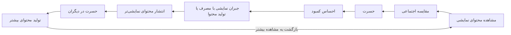

---
{"dg-publish":true,"dg-permalink":"/spd/instagram-envy","tags":["اینستاگرام"],"permalink":"/spd/instagram-envy/","dgPassFrontmatter":true,"dg-note-properties":{"tags":["اینستاگرام"]}}
---

در ادامه یادداشت‌های سبک زندگی دیجیتال، این بار می‌خواهم از چیزی بنویسم که فکر می‌کنم مهم‌ترین کاری است که اینستاگرام با ما می‌کند. اگر بخواهم در یک جمله خلاصه کنم، می‌گویم: **اینستاگرام از ما زمان می‌گیرد، انرژی می‌گیرد، بهترین ساعات روز و بهترین سال‌های عمرمان را می‌گیرد و به جایش به ما حسرت می‌دهد.**

شاید در ظاهر عجیب به نظر برسد؛ ما برای سرگرمی، برای دیدن دوستان، برای خبر یا حتی برای کار وارد اینستاگرام می‌شویم. اما خروجی پنهان این پرسه‌زدن‌ها، خیلی وقت‌ها یک احساس است: احساس کم‌آوردن. احساس اینکه دیگران زندگی بهتری دارند، موفق‌ترند، خوش‌بخت‌ترند، زیباترند و فقط ما هستیم که در میانه زندگی سخت و بی‌نظم خود گیر کرده‌ایم.

این احساس، نامش حسرت است و فکر می‌کنم مهم‌ترین محصول اینستاگرام، دقیقاً همین است.

## هایلایت زندگی دیگران، پشت‌صحنه زندگی ما

در اینستاگرام هیچ‌کس زندگی واقعی‌اش را نشان نمی‌دهد. آنچه می‌بینیم منتخبی است از بهترین لحظه‌ها: صبحانه‌ای که قشنگ چیده شده، سفرِ لحظه طلایی، جشن تولد، ترفیع شغلی، عکس بعد از تمرین، خانه‌ای که تازه تمیز شده، رابطه‌ای که در استوری عاشقانه به نظر می‌رسد.

ما معمولاً پشت‌صحنه زندگی خودمان را می‌دانیم: صبح‌های بی‌حوصلگی، پیام‌های بی‌جواب، قبض‌ها، نگرانی‌ها، دعواها، شکست‌ها و ساعت‌هایی که حالمان خوب نیست و کاری از دستمان برنمی‌آید. اما از زندگی دیگران فقط همان قاب‌های براق را می‌بینیم. بعد ناخودآگاه مقایسه می‌کنیم: پشت‌صحنه خودمان را با هایلایت دیگران.

نتیجه این مقایسه از قبل معلوم است: ما می‌بازیم.

روان‌شناسی به این می‌گوید «مقایسه اجتماعی صعودی»؛ یعنی خودمان را با کسانی مقایسه می‌کنیم که در ظاهر از ما بهترند. این مقایسه لزوماً واقعی نیست، اما احساسش کاملاً واقعی است. کافی است چند استوری از مسافرت دیگران ببینیم تا زندگی خودمان بی‌رونق و خسته‌کننده به نظر برسد. در حالی که یک ساعت قبل، شاید از همان زندگی راضی بودیم.

## حسرت، موتور اقتصاد اینستاگرام

نکته اینجاست که این حسرت، اتفاقی نیست. برای اینستاگرام، حسرت یک محصول جانبی نیست؛ یک سوخت است.

آدمی که احساس کم‌آوردن می‌کند، بیشتر می‌ماند، بیشتر اسکرول می‌کند، بیشتر مقایسه می‌کند و بیشتر دیده می‌شود. محتوایی که حس حسرت یا مقایسه را برمی‌انگیزد، معمولاً تعامل بیشتری می‌گیرد؛ چون ما را درگیر می‌کند، چون کنجکاوی‌مان را تحریک می‌کند، چون دوست داریم بدانیم «او چگونه به اینجا رسیده؟» و «چرا من به اینجا نرسیده‌ام؟».

این درگیری احساسی، همان چیزی است که پلتفرم برای فروش تبلیغات به آن نیاز دارد. هرچه بیشتر حسرت بخوریم، بیشتر اسکرول می‌کنیم. هرچه بیشتر اسکرول کنیم، تبلیغات بیشتری می‌بینیم. پس حسرت ما فقط یک حس شخصی نیست؛ یک دارایی اقتصادی برای پلتفرم است.

## چرخه جبران نمایشی

اما حسرت فقط به **اسکرول** ختم نمی‌شود. حسرت یک فشار روانی ایجاد می‌کند که باید تخلیه شود. ما فکر می‌کنیم باید این فاصله را جبران کنیم؛ باید ثابت کنیم زندگی ما هم دیدنی است.

این جبران معمولاً به شکل «مصرف نمایشی» اتفاق می‌افتد. می‌رویم رستورانی که خیلی گران است، نه فقط برای لذت خودمان، بلکه چون حس می‌کنیم باید یک صبحانه لاکچری بخوریم تا از قافله عقب نمانیم. لباسی می‌خریم که شاید لازم نداریم، ولی در عکس خوب دیده می‌شود. سفری می‌رویم که برنامه‌اش بیشتر حول عکس‌های خوب می‌چرخد تا تجربه واقعی.

بعد همان را پست و استوری می‌کنیم. و این پست و استوری، دقیقاً همان نقشی را برای دوستان و فالوورهای ما ایفا می‌کند که پست‌های دیگران برای ما ایفا کرد: تولید حسرت.

اینجاست که چرخه کامل می‌شود:

۱. حسرت می‌خوریم.
۲. احساس کم‌آوردن می‌کنیم.
۳. برای جبران، خرج می‌کنیم یا تجربه‌ای نمایشی می‌سازیم.
۴. آن را منتشر می‌کنیم.
۵. دیگران حسرت می‌خورند.
۶. دیگران هم جبران می‌کنند.
۷. و این چرخه ادامه پیدا می‌کند.

در این چرخه، همه در حال اجرای یک نمایش بی‌پایان هستیم و مخاطب اصلی ما آدم‌های واقعی نیستند؛ مخاطب، همان حسرتی است که در ذهن دیگران شکل می‌گیرد.

## نگاه سیستمی: حلقه تقویت‌کننده حسرت

اگر یک قدم عقب بایستیم و به این چرخه از بیرون نگاه کنیم، چیزی که می‌بینیم دیگر فقط یک عادت شخصی یا ضعف اراده نیست؛ یک سیستم است و از نگاه تفکر سیستمی، این چرخه دقیقاً یک «حلقه بازخوردی تقویت‌کننده» است.

در حلقه تقویت‌کننده، خروجی هر مرحله، ورودی مرحله بعد را تشدید می‌کند. یعنی هرچه بیشتر پیش می‌رویم، سیستم قوی‌تر و سریع‌تر می‌چرخد.

می‌توانیم این حلقه را این‌طور ترسیم کنیم:

**مشاهده محتوای نمایشی ← مقایسه اجتماعی ← حسرت ← احساس کمبود ← جبران نمایشی با مصرف یا تولید محتوا ← انتشار محتوای نمایشی‌تر ← حسرت در دیگران ← تولید محتوای بیشتر ← بازگشت به مشاهده بیشتر**

این حلقه در دو سطح هم‌زمان کار می‌کند:

**سطح فردی:** ما محتوای براق دیگران را می‌بینیم، حسرت می‌خوریم، برای جبران، چیزهایی می‌خریم یا لحظه‌هایی را می‌سازیم که فقط برای نمایش است، بعد آن را منتشر می‌کنیم. این انتشار، استاندارد نمایش را بالاتر می‌برد و باعث می‌شود خودمان هم در آینده محتوای براق‌تری ببینیم و باز حسرت بخوریم.

**سطح پلتفرم:** توجه و زمان کاربر، تعامل می‌سازد؛ تعامل، درآمد تبلیغاتی می‌سازد؛ درآمد، الگوریتم را برای نمایش محتوای حسرت‌برانگیزتر بهینه می‌کند؛ محتوای حسرت‌برانگیزتر، زمان استفاده را بیشتر می‌کند و باز حسرت بیشتری تولید می‌شود. این حلقه هم تقویت‌کننده است.

نکته مهم در تفکر سیستمی این است که رفتار یک سیستم، بیشتر از نیات افراد، از ساختار حلقه‌ها و هدف سیستم تعیین می‌شود. هدف سیستم اینستاگرام، افزایش تعامل و درآمد تبلیغاتی است، نه سلامت روان کاربر. تا وقتی این هدف تغییر نکند، حسرت نه یک عارضه، بلکه یک خروجی مطلوب برای سیستم است.

در این سیستم، هیچ حلقه تعدیل‌کننده‌ای به‌طور طبیعی فعال نیست. یعنی هیچ مکانیزم درونی وجود ندارد که بگوید «کافی است، دیگر حسرت نخور، دیگر مقایسه نکن». تنها چیزی که می‌تواند حلقه را کند یا متوقف کند، ورود آگاهانه یک عامل بیرونی است: سواد دیجیتال، محدودیت زمانی، یا تغییر هدف شخصی.

یکی دیگر از ویژگی‌های این سیستم، تأخیر است. اثر تخریبی حسرت روی سلامت روان معمولاً با تأخیر ظاهر می‌شود. در لحظه فکر می‌کنیم فقط داریم چند استوری نگاه می‌کنیم، اما به‌مرور احساس مزمن ناکافی بودن در ما انباشته می‌شود. این تأخیر باعث می‌شود ارتباط بین علت و معلول را نبینیم و نتوانیم به‌موقع واکنش نشان دهیم.

در چنین سیستمی، مؤثرترین نقطه اهرمی این نیست که مدام با خودمان بگوییم «حسادت نکن» یا سعی کنیم واقعی بودن محتوای دیگران را تحلیل کنیم. نقطه اهرمی اصلی، تغییر هدف شخصی است: از «اثبات زندگی خوب به دیگران» به «تجربه زندگی برای خود». تا وقتی هدف ما دیده‌شدن و تأیید‌شدن در چشم دیگران باشد، در همان حلقه می‌مانیم. اما به محض اینکه هدف تغییر کند، حلقه از درون می‌شکند.

## چرا این چرخه این‌قدر قوی است؟

چون به یکی از قدیمی‌ترین نیازهای ما گره خورده است: نیاز به دیده‌شدن، نیاز به تأیید، نیاز به اینکه جایگاه ما در گروه امن باشد. انسان در طول تاریخ با مقایسه خود با دیگران جایگاهش را سنجیده است. اما اینستاگرام این مقایسه را از یک فرایند محدود و محلی، به یک فرایند بی‌پایان و جهانی تبدیل کرده است.

قبلاً خودمان را با چند همسایه، هم‌کلاسی یا همکار مقایسه می‌کردیم. حالا خودمان را با هزاران آدم گزینش‌شده مقایسه می‌کنیم که هرکدام فقط بهترین بخش زندگی‌شان را نشان می‌دهند. هیچ‌کس نمی‌تواند در این مقایسه برنده شود.

نتیجه‌اش همان است که گفتیم: ما فکر می‌کنیم همه بهترین زندگی را دارند و فقط ما هستیم که زندگی سخت داریم. این یک خطای شناختی است، اما آن‌قدر تکرار می‌شود که باورمان می‌شود.

## نتیجه‌گیری

نمی‌خواهم بگویم اینستاگرام را حذف کنید؛ هرچند برای بعضی‌ها شاید بهترین راه باشد. اما قبل از هر تصمیمی، بد نیست این چرخه را بشناسیم.

هر بار که در اینستاگرام احساس حسرت کردی، به خودت یادآوری کن: «من دارم پشت‌صحنه زندگی خودم را با هایلایت زندگی دیگران مقایسه می‌کنم.»

و هر بار که خواستی برای جبرانِ حسرت، جایی بروی، چیزی بخری یا تصویری بسازی، یک لحظه بایست و بپرس: «من دارم زندگی می‌کنم، یا دارم برای تولید حسرت در دیگران محتوا می‌سازم؟»

شکستن چرخه از همین آگاهی شروع می‌شود. اینستاگرام همیشه خواهد توانست حسرت بفروشد؛ اما اینکه ما خریدار باشیم یا نه، انتخاب ماست.